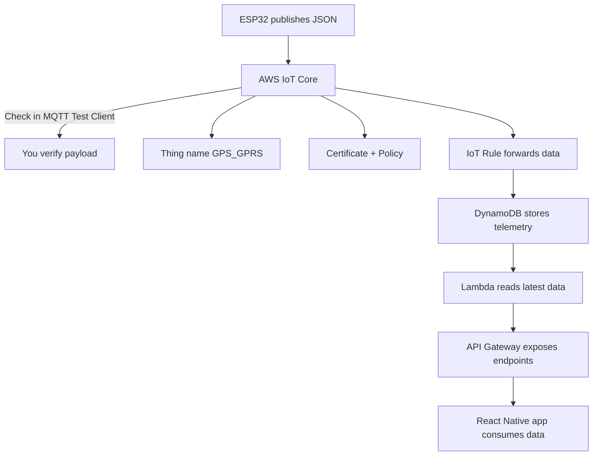

# AirBuddi App Architecture

Below is the app flow diagram describing how the ESP32 device publishes telemetry and how the mobile app consumes it.

Notes:

- Thing name used by the device: `GPS_GPRS`.
- IoT Rule forwards incoming MQTT messages to a Lambda which writes to DynamoDB.
- The Lambda exposes a read endpoint via API Gateway that the React Native app polls or fetches.
