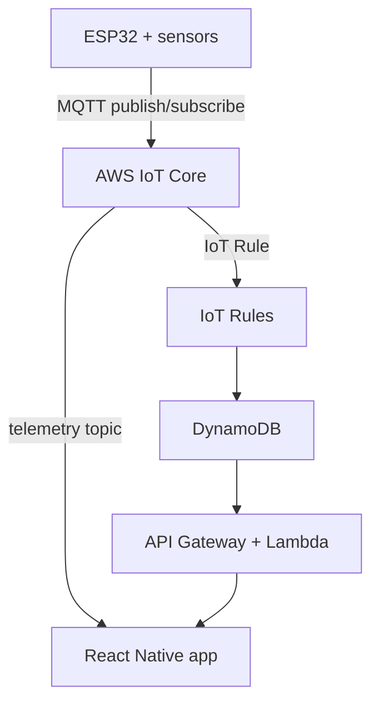

6565This is a new [**React Native**](https://reactnative.dev) project, bootstrapped using [`@react-native-community/cli`](https://github.com/react-native-community/cli).

# Getting Started

> **Note**: Make sure you have completed the [Set Up Your Environment](https://reactnative.dev/docs/set-up-your-environment) guide before proceeding.

## Step 1: Start Metro

First, you will need to run **Metro**, the JavaScript build tool for React Native.

To start the Metro dev server, run the following command from the root of your React Native project:

```sh
# Using npm
npm start

# OR using Yarn
yarn start
```

## Step 2: Build and run your app

With Metro running, open a new terminal window/pane from the root of your React Native project, and use one of the following commands to build and run your Android or iOS app:

### Android

```sh
# Using npm
npm run android

# OR using Yarn
yarn android
```

### iOS

For iOS, remember to install CocoaPods dependencies (this only needs to be run on first clone or after updating native deps).

The first time you create a new project, run the Ruby bundler to install CocoaPods itself:

```sh
bundle install
```

Then, and every time you update your native dependencies, run:

```sh
bundle exec pod install
```

For more information, please visit [CocoaPods Getting Started guide](https://guides.cocoapods.org/using/getting-started.html).

```sh
# Using npm
npm run ios

# OR using Yarn
yarn ios
```

If everything is set up correctly, you should see your new app running in the Android Emulator, iOS Simulator, or your connected device.

This is one way to run your app — you can also build it directly from Android Studio or Xcode.

## Step 3: Modify your app

Now that you have successfully run the app, let's make changes!

Open `App.tsx` in your text editor of choice and make some changes. When you save, your app will automatically update and reflect these changes — this is powered by [Fast Refresh](https://reactnative.dev/docs/fast-refresh).

When you want to forcefully reload, for example to reset the state of your app, you can perform a full reload:

- **Android**: Press the <kbd>R</kbd> key twice or select **"Reload"** from the **Dev Menu**, accessed via <kbd>Ctrl</kbd> + <kbd>M</kbd> (Windows/Linux) or <kbd>Cmd ⌘</kbd> + <kbd>M</kbd> (macOS).
- **iOS**: Press <kbd>R</kbd> in iOS Simulator.

## Congratulations! :tada:

You've successfully run and modified your React Native App. :partying_face:

### Now what?

- If you want to add this new React Native code to an existing application, check out the [Integration guide](https://reactnative.dev/docs/integration-with-existing-apps).
- If you're curious to learn more about React Native, check out the [docs](https://reactnative.dev/docs/getting-started).

# Troubleshooting

If you're having issues getting the above steps to work, see the [Troubleshooting](https://reactnative.dev/docs/troubleshooting) page.

# Learn More

To learn more about React Native, take a look at the following resources:

- [React Native Website](https://reactnative.dev) - learn more about React Native.
- [Getting Started](https://reactnative.dev/docs/environment-setup) - an **overview** of React Native and how setup your environment.
- [Learn the Basics](https://reactnative.dev/docs/getting-started) - a **guided tour** of the React Native **basics**.
- [Blog](https://reactnative.dev/blog) - read the latest official React Native **Blog** posts.
- [`@facebook/react-native`](https://github.com/facebook/react-native) - the Open Source; GitHub **repository** for React Native.

# AirBuddi Live Data Setup

AirBuddi now includes a live AWS IoT Core MQTT layer. The dashboard still renders the same reusable UI, but the data source can switch from mock state to real telemetry without changing the cards.

## Files to review first

- [src/config/awsIotConfig.ts](src/config/awsIotConfig.ts)
- [src/services/awsIot/awsIotClient.ts](src/services/awsIot/awsIotClient.ts)
- [src/features/dashboard/dashboardSlice.ts](src/features/dashboard/dashboardSlice.ts)
- [src/features/dashboard/useDashboardRealtimeBridge.ts](src/features/dashboard/useDashboardRealtimeBridge.ts)
- [src/features/dashboard/DashboardScreen.tsx](src/features/dashboard/DashboardScreen.tsx)

## How the live path works

1. `App.tsx` wraps the app in a Redux provider.
2. `DashboardScreen` reads the dashboard state from Redux.
3. `useDashboardRealtimeBridge` opens an MQTT connection when live mode is enabled.
4. Incoming telemetry updates the Redux slice.
5. Quick control actions publish JSON commands back to AWS IoT Core.

## Recommended system architecture

Your target flow is a good fit for this app:



Use AWS IoT Core for device telemetry and commands, DynamoDB for history, and API Gateway + Lambda for app features that need query/summary data.

## ESP32 telemetry contract

The app is now prepared for ESP32 payloads that contain multiple sensor readings in one message. A good payload shape is:

```json
{
  "esp32": {
    "deviceId": "airbuddi-pure-x",
    "deviceName": "AirBuddi Pure X",
    "ts": "2026-07-04T09:30:00Z",
    "connection": "connected",
    "power": "on",
    "mode": "auto",
    "fanSpeed": "2",
    "aqi": 46,
    "filterHealth": 78,
    "remainingLifeDays": 42,
    "sensors": [
      { "key": "temperature", "value": 24.6, "unit": "°C", "status": "good" },
      { "key": "humidity", "value": 52, "unit": "%", "status": "good" },
      { "key": "pm2_5", "value": 18, "unit": "µg/m³", "status": "warning" },
      { "key": "pm10", "value": 31, "unit": "µg/m³", "status": "good" },
      { "key": "co2", "value": 612, "unit": "ppm", "status": "good" },
      { "key": "voc", "value": 0.21, "unit": "ppm", "status": "good" }
    ]
  }
}
```

That format keeps all sensor readings together, which is easier for ESP32 publishing and easier for the app to render.

## Suggested MQTT topics

Keep the topics device-scoped:

- `airbuddi/<deviceId>/telemetry`
- `airbuddi/<deviceId>/status`
- `airbuddi/<deviceId>/command`
- `airbuddi/<deviceId>/connection`

If you add more ESP32 devices later, each one should use its own `deviceId` with the same topic pattern.

## IoT Rules and backend path

Use AWS IoT Rules for persistence and downstream APIs:

1. ESP32 publishes telemetry to AWS IoT Core.
2. IoT Rule writes the raw telemetry to DynamoDB.
3. Lambda can shape history, device summaries, or alerts.
4. API Gateway exposes those Lambda results to the app.

This keeps the live dashboard responsive while still giving you historical views and server-side features later.

## Architecture & Infra

- Diagram: see [ARCHITECTURE.md](ARCHITECTURE.md) for the system flow (ESP32 → IoT Core → IoT Rule → DynamoDB → Lambda → API → App).
- Quick infra: `infra/template.yaml` is a SAM template that provisions an IoT Topic Rule, Lambda, DynamoDB table, and API Gateway. See [infra/README.md](infra/README.md) for deploy steps.
- After deploying the SAM template, copy the `TelemetryApi` output URL into `telemetryApiConfig.baseUrl` in `src/config/awsIotConfig.ts`.
- Device Thing name: use `GPS_GPRS` on your ESP32 so topics resolve to `airbuddi/GPS_GPRS/telemetry`.

## Enable AWS IoT Core

Open [src/config/awsIotConfig.ts](src/config/awsIotConfig.ts) and set:

- `enabled: true`
- `endpoint` to your AWS IoT ATS endpoint
- `region` to the AWS region where IoT Core lives
- `clientId` to a stable device-specific value
- `credentialsProvider` to return temporary AWS credentials

You should replace the placeholder config in [src/config/awsIotConfig.ts](src/config/awsIotConfig.ts) with your real IoT Core ATS endpoint and a short-lived credentials provider when you are ready to connect the app.

If the ESP32 is connected but the app still shows no readings, check this first: the ESP32 certificate only authenticates the ESP32. The React Native app connects through MQTT over WebSockets, so it must sign the WebSocket URL with temporary AWS credentials from Cognito Identity Pool or your backend. Without those credentials the app cannot subscribe to AWS IoT Core, even when the endpoint is correct.

Important: the endpoint must be an IoT Core ATS MQTT hostname, not an API Gateway hostname. The correct shape is:

```txt
<prefix>-ats.iot.<region>.amazonaws.com
```

An `execute-api` hostname will not work for MQTT over WebSockets.

### Example config shape

```ts
export const awsIotConfig = {
  enabled: true,
  endpoint: 'your-endpoint-ats.iot.us-east-1.amazonaws.com',
  region: 'us-east-1',
  clientId: 'airbuddi-pure-x',
  deviceId: 'airbuddi-pure-x',
  topics: {
    telemetry: 'airbuddi/airbuddi-pure-x/telemetry',
    status: 'airbuddi/airbuddi-pure-x/status',
    command: 'airbuddi/airbuddi-pure-x/command',
    connection: 'airbuddi/airbuddi-pure-x/connection',
  },
  credentialsProvider: async () => ({
    accessKeyId: 'TEMP_ACCESS_KEY',
    secretAccessKey: 'TEMP_SECRET_KEY',
    sessionToken: 'TEMP_SESSION_TOKEN',
  }),
};
```

## Recommended auth approach

Do not hardcode long-lived AWS keys in the app. Use temporary credentials from one of these flows:

- Cognito Identity Pool
- A secure backend that issues short-lived IAM credentials
- Amplify or a custom auth service that can provide a credentials provider

For a quick development test only, you can paste short-lived STS credentials into `temporaryAppCredentials` in [src/config/awsIotConfig.ts](src/config/awsIotConfig.ts). Remove them before committing or sharing the app.

The IAM policy attached to the app credentials needs at least these IoT permissions for your account, region, client id, and topics:

```json
{
  "Version": "2012-10-17",
  "Statement": [
    {
      "Effect": "Allow",
      "Action": ["iot:Connect"],
      "Resource": "arn:aws:iot:eu-north-1:YOUR_ACCOUNT_ID:client/airbuddi-mobile-airbuddi-pure-x"
    },
    {
      "Effect": "Allow",
      "Action": ["iot:Subscribe"],
      "Resource": [
        "arn:aws:iot:eu-north-1:YOUR_ACCOUNT_ID:topicfilter/airbuddi/airbuddi-pure-x/telemetry",
        "arn:aws:iot:eu-north-1:YOUR_ACCOUNT_ID:topicfilter/airbuddi/airbuddi-pure-x/status",
        "arn:aws:iot:eu-north-1:YOUR_ACCOUNT_ID:topicfilter/airbuddi/airbuddi-pure-x/connection"
      ]
    },
    {
      "Effect": "Allow",
      "Action": ["iot:Receive"],
      "Resource": [
        "arn:aws:iot:eu-north-1:YOUR_ACCOUNT_ID:topic/airbuddi/airbuddi-pure-x/telemetry",
        "arn:aws:iot:eu-north-1:YOUR_ACCOUNT_ID:topic/airbuddi/airbuddi-pure-x/status",
        "arn:aws:iot:eu-north-1:YOUR_ACCOUNT_ID:topic/airbuddi/airbuddi-pure-x/connection"
      ]
    },
    {
      "Effect": "Allow",
      "Action": ["iot:Publish"],
      "Resource": "arn:aws:iot:eu-north-1:YOUR_ACCOUNT_ID:topic/airbuddi/airbuddi-pure-x/command"
    }
  ]
}
```

## MQTT topic contract

The dashboard expects telemetry in JSON form. A good starting payload looks like this:

```json
{
  "aqi": 46,
  "connection": "connected",
  "device": {
    "name": "AirBuddi Pure X",
    "status": "Online",
    "mode": "auto",
    "power": "on",
    "lastUpdated": "2026-07-03T09:30:00Z"
  },
  "filterHealth": 78,
  "remainingLifeDays": 42,
  "sensors": [
    { "id": "temp", "value": 24.6, "unit": "°C", "status": "good" },
    { "id": "humidity", "value": 52, "unit": "%", "status": "good" }
  ]
}
```

The app also accepts a simpler ESP32 test payload on `airbuddi/airbuddi-pure-x/telemetry`:

```json
{
  "deviceId": "airbuddi-pure-x",
  "aqi": 46,
  "temperature": 24.6,
  "humidity": 52,
  "pm2_5": 18,
  "pm10": 31,
  "co2": 612,
  "voc": 0.21
}
```

Fast sanity test:

1. In AWS IoT Core, open MQTT test client.
2. Subscribe to `airbuddi/airbuddi-pure-x/telemetry`.
3. Publish the simple payload above to the same topic.
4. Confirm your ESP32 publishes to that exact topic and your app credentials allow `iot:Subscribe` and `iot:Receive`.

Topic usage in the app:

- `telemetry` publishes full sensor snapshots.
- `status` can carry device online/offline updates.
- `connection` can carry heartbeat or connectivity messages.
- `command` is used by the app to publish power, mode, and fan control commands.

## Quick control commands

The quick controls publish command messages like this:

```json
{ "type": "power", "value": "on", "timestamp": "2026-07-03T09:30:00Z" }
```

## Run after setup

```sh
npm install
npm start
npm run android
```

If AWS IoT Core is configured correctly, the dashboard will move into connected mode and start showing live telemetry updates in real time.
